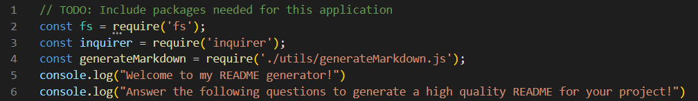
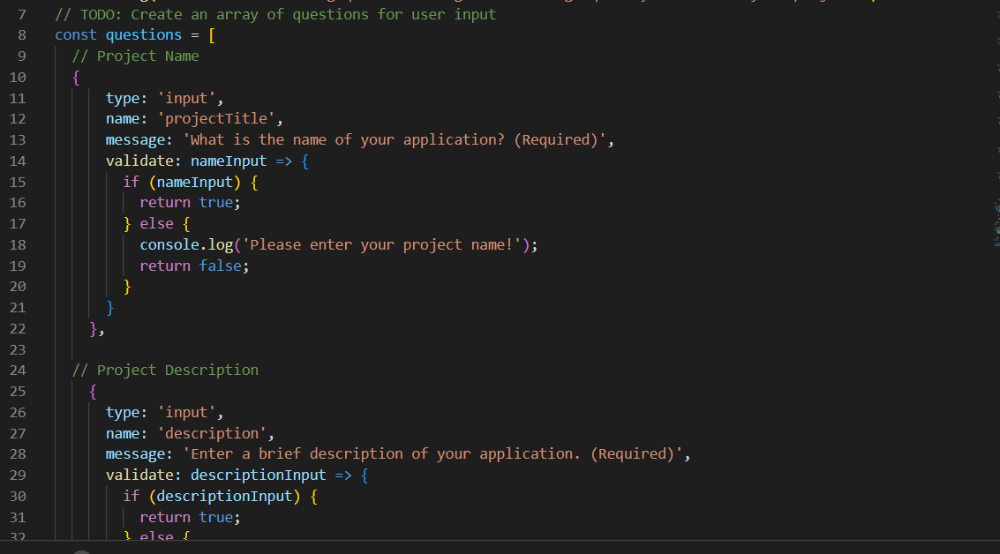
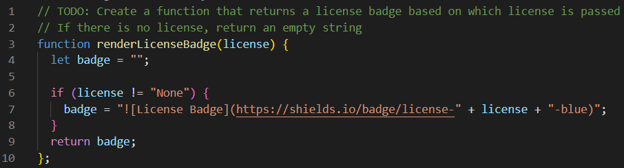
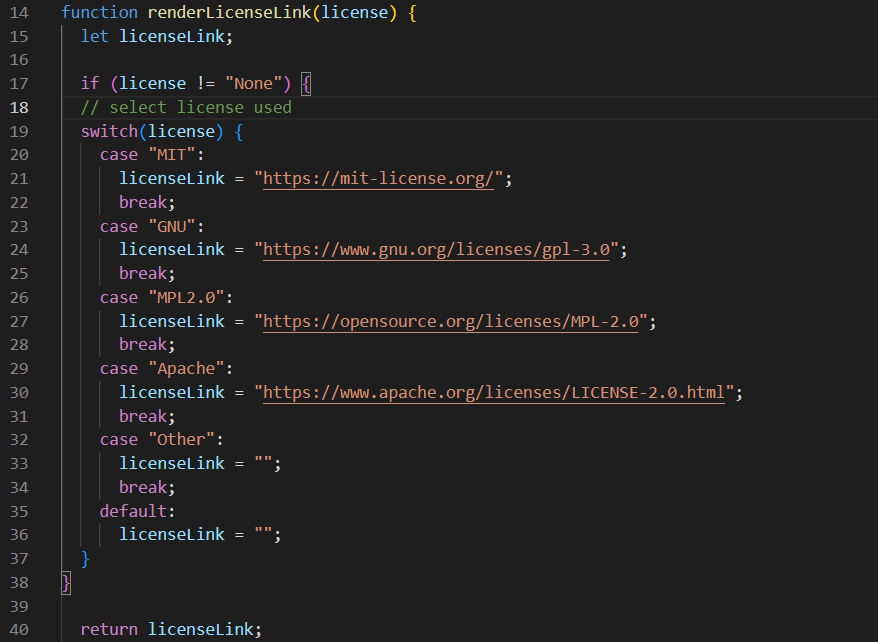
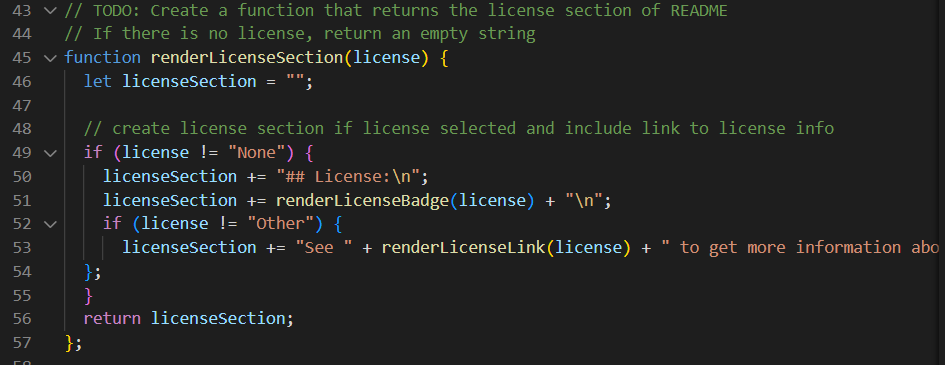
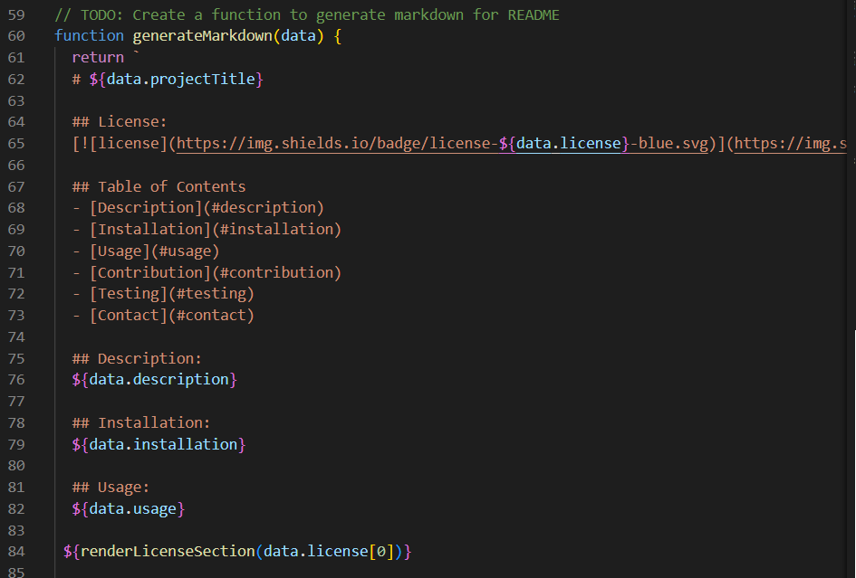
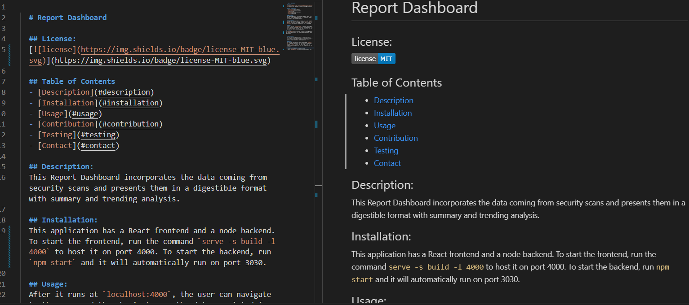

  # ReadThis: A README Generator

  ## License:
  

  ## Table of Contents
  - [Description](#description)
  - [Installation](#installation)
  - [Usage](#usage)
  - [Contribution](#contribution)
  - [Testing](#testing)
  - [Contact](#contact)

  ## Description:
  The challenge this week was to create an application that would help the user generate their own README.md file using Node.js.
  
  ## Installation:
  To get this application to work I needed to use the Inquirer npm package. After downloading that, I was able to set up my questions for the user. 

  

  ## Usage:
  The user starts the process by typing in: node index into the command line, starting the application by running the code found in my index.js. Here I have my questions for the user.

  

  The data regarding the badge is written in the generateMarkdown file as is the framework for the README file layout.

  There is a function for generating the license badge.

  

  There is a function to generate the license link.

  
  
  There is a function to add in a License section to the markdown complete with links and badge.

  

  Included is the framework for the generated README file.

  

 ## License:

  ## Testing:
  I will be submitting the document created during my recording as my sample README file.

   

  ## Contact Information:
  - Github: [hvphan1993](https://github.com/hvphan1993)
  - Email: [hvphan1993@gmail.com](mailto:hvphan1993@gmail.com)
  - Link to video walkthrough: https://drive.google.com/file/d/1jcIs3BntCuTSvy6Pcc8xcpo6VUYmlMnM/view

